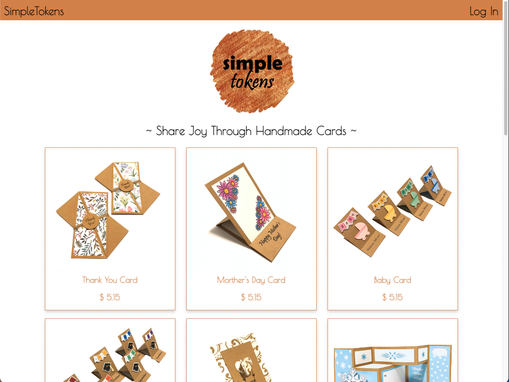
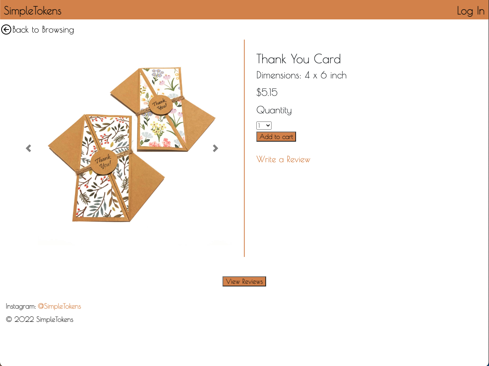
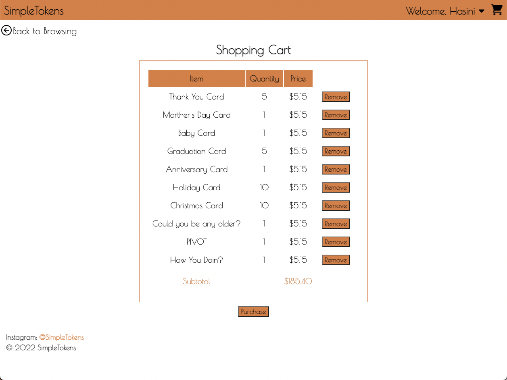
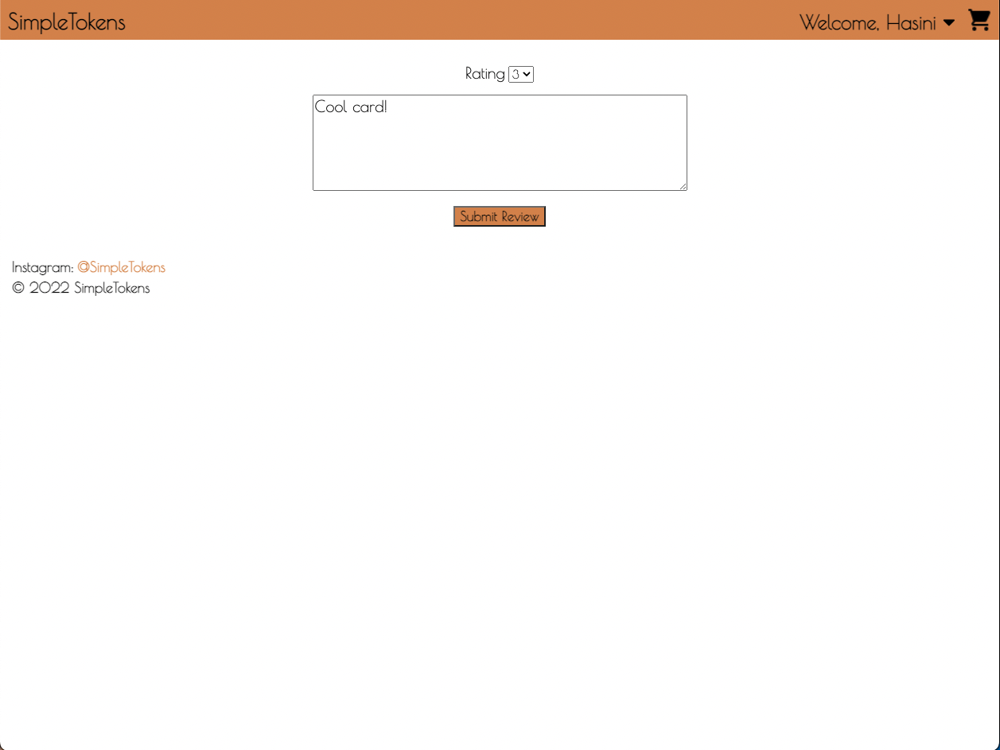
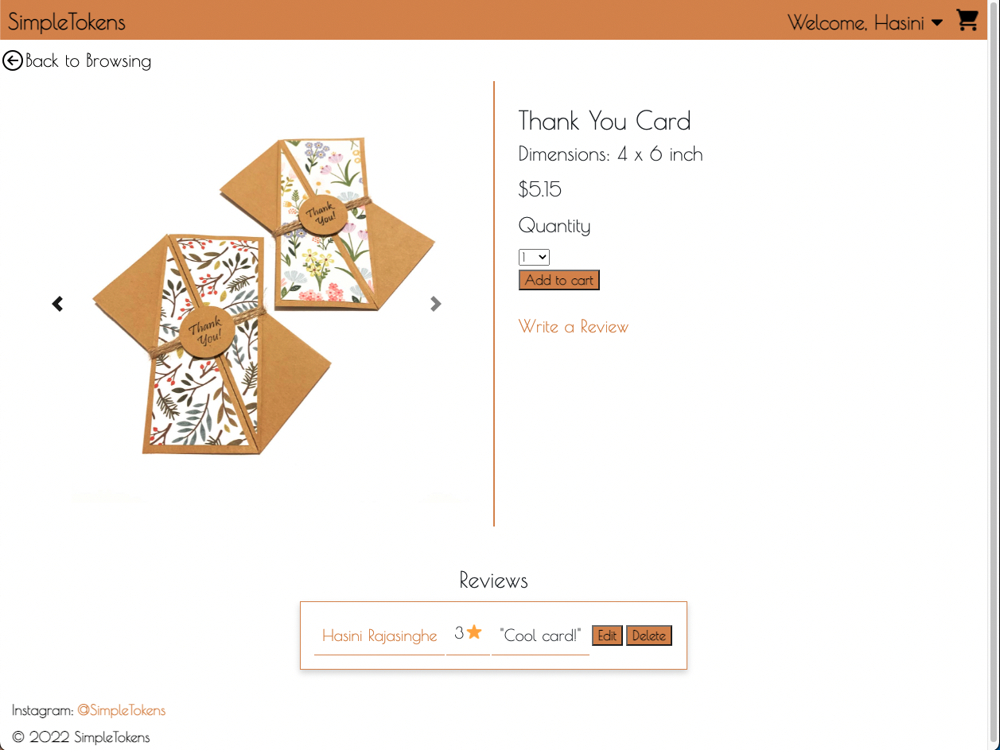
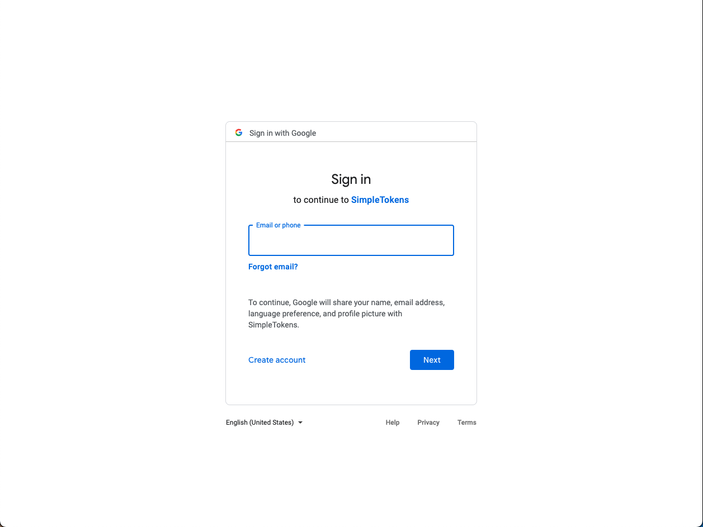

# SimpleTokens 

## Project Description 

SimpleTokens is an E-commerce website for a small greeting card business. The website allow users to browse and buy greeting cards, as well as sign up for a personal account. With a personal account, the users can post reviews of the products and share their thoughts.

Website link: https://simple-tokens.herokuapp.com/

## Project Images 
Homepage View
 

Product Detail View

Shopping Cart View

New Review Submission View

Display Review View

Log In Page (via Google)

## Technologies Used
- HTML/EJS
- Javascript
- NodeJS
- CSS
- Express
- MongoDB/Atlas
- Postman
- Heroku
- Bootstrap
## User Stories 
### MVP Goals 
- [x] As a user, I would like to have the option to signup/login
- [x] As a user, I would like to browse products, whether logged in or not.
- [x] As a user, I would like view details of products
- [x] As a user, I would like to see product reviews
- [x] As a logged in user,  I would like to have the option to log in/log out
- [x]  As a logged in user, I would like to leave reviews for products
- [x] As a logged in user, I would like to have the option to add product to the cart
- [x] As a logged in user,  I would like to view and manage the cart

### Stretch Goals 
- [x] As a user, I would like to see image carousel for products.
- [ ] As a user, I would like to see a search function.
- [ ] As a logged in user, I would like to add products to a favorites list.
- [ ] As a logged in user, I would like to see my previous orders.
## Wireframes 
Homepage View

Logged-in User View 

Product Detail View 

Shopping Cart View

Sign Up View 

Log In View 

## Resources Used
https://developer.mozilla.org/en-US/

https://www.w3schools.com/

https://stackoverflow.com/

https://wireframe.cc/

https://icons8.com/icons/set/favicon

## Problems 
Originally, the goal was to have a sign up page (separate to the log in page) that was local to the business per se. However with the complexity of building a form that would request user information and store data with encryption came with challenges. Google OAuth was used instead to overcome this challege. 